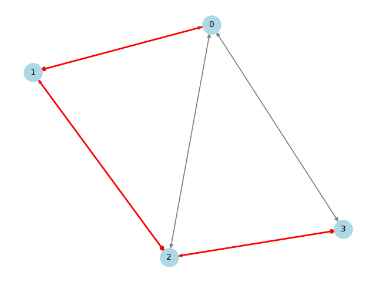
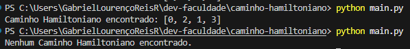

# Encontrar Caminho Hamiltoniano

## 🔍 Descrição do Projeto

Este projeto tem como objetivo implementar um algoritmo em Python para encontrar um Caminho Hamiltoniano em um grafo direcionado ou não direcionado.  
Um Caminho Hamiltoniano é uma sequência de vértices em um grafo que visita cada vértice **exatamente uma vez**, podendo ou não retornar ao ponto de origem (ciclo Hamiltoniano). Esse problema está relacionado a áreas como roteamento, otimização e circuitos.

## 🐍 Versão do Python
Este projeto foi desenvolvido na versão Python 3.11.9 do Python.

## 📦 Instalação de Dependências

Certifique-se de instalar as bibliotecas necessárias antes de executar o programa:

```bash
pip install networkx matplotlib
```

## ▶️ Como executar
1. Clone o repositório do GitHub para sua máquina local:
   ```
   git clone https://github.com/gabrielreisresende/hamiltonian-path-finder.git
   ```
2. Certifique-se de que Python 3.x está instalado em seu sistema.  
3. Navegue até o diretório do projeto através do terminal ou prompt de comando.  
4. Execute o arquivo `main.py` com o comando:
   ```
   python main.py
   ```

## 🖼️ Visualização do Grafo

O programa gera uma visualização do grafo original e destaca o Caminho Hamiltoniano (se encontrado). A imagem será salva automaticamente na pasta `assets` com o nome `graph_visualization.png`.

### Exemplo de Visualização:

Abaixo está um exemplo de visualização gerada pelo programa:



## 🧠 Implementação do Algoritmo

O algoritmo utiliza **backtracking** para encontrar um Caminho Hamiltoniano. Backtracking é uma técnica de resolução de problemas que utiliza uma abordagem sistemática para explorar todas as possíveis soluções de um problema, retrocedendo (ou "voltando atrás") sempre que uma solução parcial não pode ser estendida para uma solução completa. É amplamente utilizado em problemas de busca e otimização, como quebra-cabeças, jogos, problemas de grafos e outros problemas combinatórios.

### 📤 Saída da execução:

Abaixo está um exemplo da saída gerada pelo programa ao encontrar ou não encontrar um Caminho Hamiltoniano:



---

## 📊 Relatório Técnico

### 🧮 Análise da Complexidade Computacional

#### 📂 Classes P, NP, NP-Completo e NP-Difícil
1. **Classificação do problema do Caminho Hamiltoniano**:
   - O problema do Caminho Hamiltoniano pertence à classe **NP-Completo**.
   - Isso ocorre porque:
     - É possível verificar em tempo polinomial se uma solução (um caminho) é válida.
     - Não existe (até onde se sabe) um algoritmo eficiente (tempo polinomial) para resolver o problema em todos os casos.
   - O problema está relacionado ao **Problema do Caixeiro Viajante**, que também é NP-Completo. No TSP, o objetivo é encontrar o menor ciclo que visita todos os vértices, enquanto no Caminho Hamiltoniano, o objetivo é apenas visitar todos os vértices uma vez.

2. **Justificativa**:
   - O Caminho Hamiltoniano é uma generalização do Problema do Caixeiro Viajante sem a restrição de minimizar a distância. Ambos os problemas são NP-Completo porque exigem a exploração de todas as combinações possíveis de caminhos em um grafo.

---

### ⏱️ Análise da Complexidade Assintótica de Tempo

1. **Complexidade Temporal do Algoritmo**:
   - A complexidade do algoritmo é **O(n!)**, onde `n` é o número de vértices no grafo.
   - Isso ocorre porque o algoritmo tenta todas as permutações possíveis de vértices para encontrar um caminho válido.

2. **Método utilizado para determinar a complexidade**:
   - A complexidade foi determinada pela **contagem de operações**:
     - Para cada vértice inicial, o algoritmo tenta adicionar todos os outros vértices ao caminho, verificando todas as combinações possíveis.
     - Isso resulta em um crescimento fatorial no número de vértices.

---

### 📐 Aplicação do Teorema Mestre

1. **É possível aplicar o Teorema Mestre?**
   - Não, o Teorema Mestre não pode ser aplicado diretamente ao problema ou ao algoritmo fornecido.
   - Justificativa:
     - O Teorema Mestre é aplicável a recorrências da forma `T(n) = aT(n/b) + O(n^d)`, que aparecem em algoritmos de divisão e conquista. O algoritmo de backtracking utilizado aqui não segue esse padrão, pois não divide o problema em subproblemas de tamanho reduzido.

---

### 📊 Análise dos Casos de Complexidade

1. **Diferenças entre os casos de complexidade**:
   - **Melhor caso**:
     - O melhor caso ocorre quando o primeiro caminho testado é um Caminho Hamiltoniano válido.
     - Complexidade: **O(n)**, pois o algoritmo verifica apenas um caminho.
   - **Caso médio**:
     - No caso médio, o algoritmo precisa explorar aproximadamente metade das permutações possíveis antes de encontrar um caminho válido.
     - Complexidade: **O(n!/2)**.
   - **Pior caso**:
     - O pior caso ocorre quando não existe um Caminho Hamiltoniano no grafo, e o algoritmo precisa explorar todas as permutações possíveis.
     - Complexidade: **O(n!)**.

2. **Impacto no desempenho**:
   - A diferença entre os casos afeta drasticamente o desempenho do algoritmo, especialmente para grafos grandes. No pior caso, o tempo de execução cresce exponencialmente, tornando o algoritmo impraticável para grafos com muitos vértices.

---

## 📚 Conclusão

O problema do Caminho Hamiltoniano é um problema clássico da classe NP-Completo, com aplicações em diversas áreas, como roteamento e otimização. O algoritmo implementado utiliza backtracking para explorar todas as possibilidades de caminhos, garantindo a solução correta, mas com alta complexidade temporal. Para grafos grandes, abordagens heurísticas ou algoritmos aproximados podem ser mais viáveis.